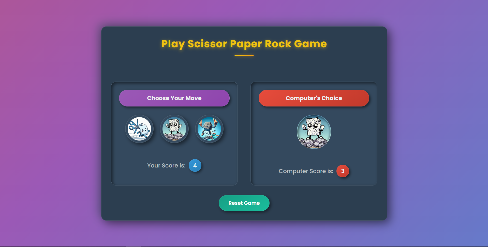

# Scissor Paper Rock


A fun and interactive browser-based Scissor, Paper, Rock game where you challenge the computer in real time!
Includes audio feedback for every result, dynamic score tracking, and a clean, responsive layout.
Built using HTML, CSS, and JavaScript – perfect for learning DOM manipulation and game logic.

## Features

- Randomized computer moves with visual representation.
- Keeps real-time scores for both player and computer.
- Sound Effects: Unique audio cues for win, lose, and draw scenarios.
- Responsive Design: Optimized for both desktop and mobile play.

## Screenshots



## 👩‍💻 Technologies Used
- HTML5
- CSS3
- JavaScript

## 🚀 Getting Started

### Installation
1. Clone the repository:
    ```
    https://github.com/Sudhir302/SPR.git
2. Navigate to the project directory:
    ``` 
    cd SPR
3. Run the app: _Go Live_

### How to play
1. Click on Scissor, Paper, or Rock to make your move.
2. The computer will automatically select its move.
3. Scores will update based on the result.
4. Use the Reset Game button to start over anytime!

## 📄 License

This project is licensed under the MIT LICENSE - see the [MIT License](./LICENSE) for details.

## Contact

Sudhir Chaudhary: csudhir302@gmail.com
